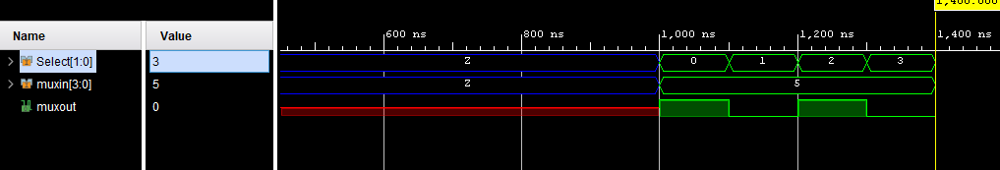

# Verilog

Verilog samples from SUBU ASIC chip design team.

 
 

# Counter Up to 25

 

# 4x1 MUX

 

# Cycle Project With Case

## 10 cycles for state 0

 

## 10 cycles for state 1

 

## 16 cycles for state 2

